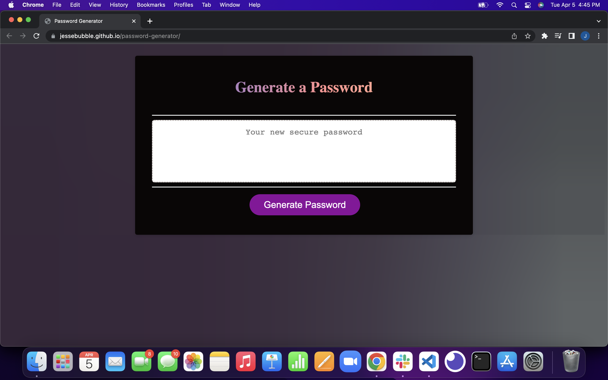

# Password-Generator
* [View My Project](https://jessebubble.github.io/password-generator/)
- built with `HTML` `CSS` and `Javascript`

## Description
- Create an application that an employee can use to generate a random password based on criteria they’ve selected.

## Resources
* [Special Characters](https://owasp.org/www-community/password-special-characters)
* [Fireship Javascript Playlist](https://www.youtube.com/playlist?list=PL0vfts4VzfNixzfaQWwDUg3W5TRbE7CyI)
## Sample

